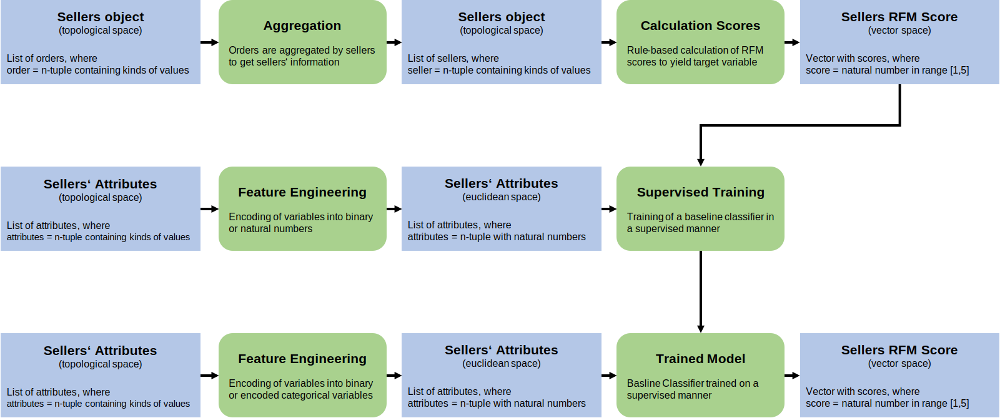

# **EVALB2B** - Estimating B2B Customer Value

This project will develop a data model to estimate the customer value for B2B partners. Based on the estimated values a company is able to evaluate the customer value of new B2B customers with no or not enough past data. Furthermore, if a company has a enough data about potential customers, this model can even used to estimate the potential value of new B2B customers.

For companies which are have indirect selling channels or are acting as an online marketplace, it is essential to evaluate their B2B customers to allocate internal efforts and budgets efficiently. As each company are continuously having new B2B customers, scoring them on past data is not possible, this model will estimate the customer value for this companies by using the data of existing customers. So, also new B2B customers could be effectively addressed with internal budgets or sales efforts (e.g. POS Marterials for Sales Marketing Activities). In case of estimating the potential customer value of B2B customers, the model can be used as decision driver for sales departments to decide data-driven if a new business relationship is valuable or not.

### **In short:**

- Track and predict partners' value
- Choose efficiently new partners
- Allocate efficiently internal budgets and efforts on sales marketing activities

</br>

## **Underlying scoring model**

A simple RFM scoring model is chosen to determine the individual score of existing B2B customers. Each dimension is calculated individually and afterwards summed up to the final score. The dimensions are calculated as following

- **Recency**: Latest order timestamp in dataset minus latest order timestamp per B2B customer
- **Frequency**: Sum of all order per seller
- **Monetary**: Sum of all order sales volumes per seller

</br>

## **Dataflows**
In order to understand the development logic behind this project the main flows of data and human work are visualized in Directed Acyclic Graphs (DAG). For this purpose two different types of DAGs are provided.
### **Transformation of data spaces**
In this version of the DAG the transformation of data spaces are represented as two different flows. The first flow (grey flow line) is designed for the transformation of data from existing business partners where all the data for score calculation is provided. In order to be able to also provide a score for new business partners the second flow (black flow line) is designed where based on existing partners data and pertners attributes are predictive model is trained and applied on new partners.

</br>

</br>
</br>

### **Human Workflow**
In this version of the DAG the human workflow of this project is shown. It contains also aspects of data exploration and data selection which is part of the experimental phase of this project.

</br>

</br>
</br>

## **Instructions**

In order to execute the code of this repository, the [start.py](src/main/start.py) has to be executed in the CMD of your computer. Before the file can be executed, you have to navigate to the projects directory (e.g. cd command for windows). Following all the possible execution commands are described and displayed.

**New customers and training needed**
```
python src/main/start.py --customers_type new --train yes
```

**New customers and no training needed**
```
python src/main/start.py --customers_type new --train no
```

**Existing customers**
```
python src/main/start.py --customers_type old
```

*Note:* 

Arguments for the [start.py](src/main/start.py) are simplified to show the usage of ArgumentParser. Therefore more arguments could be added to be more flexible during execution.