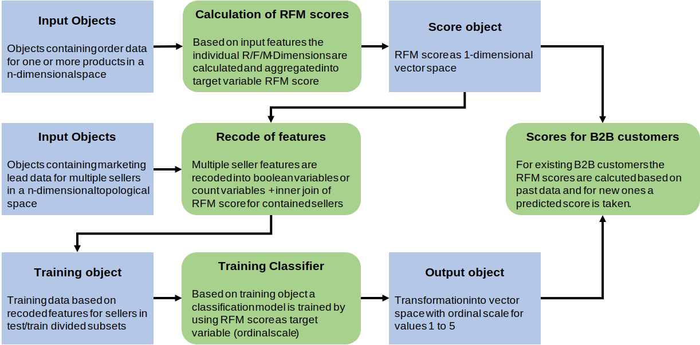

# **EVALB2B** - Estimating B2B Customer Value

This project will develop a data model to estimate the customer value for B2B customers. Based on the estimated values a company is able to evaluate the customer value of new B2B customers with no or not enough past data. Furthermore, if a company has a enough data about potential customers, this model can even used to estimate the potential value of new B2B customers.

For companies which are have indirect selling channels or are acting as an online marketplace, it is essential to evaluate their B2B customers to allocate internal efforts and budgets efficiently. As each company are continuously having new B2B customers, scoring them on past data is not possible, this model will estimate the customer value for this companies by using the data of existing customers. So, also new B2B customers could be effectively addressed with internal budgets or sales efforts (e.g. POS Marterials for Sales Marketing Activities). In case of estimating the potential customer value of B2B customers, the model can be used as decision driver for sales departments to decide data-driven if a new business relationship is valuable or not.

### **In short:**

- Track and predict partners' value
- Choose efficiently new partners
- Allocate efficiently internal budgets and efforts on sales marketing activities

 

## **Underlying scoring model**

A simple RFM scoring model is chosen to determine the individual score of existing B2B customers. Each dimension is calculated individually and afterwards summed up to the final score. The dimensions are calculated as following

- **Recency**: Latest order timestamp in dataset - latest order timestamp per B2B customer
- **Frequency**: Sum of all order per seller
- **Monetary**: Sum of all order sales volumes per seller

 

## **Dataflows**
 
